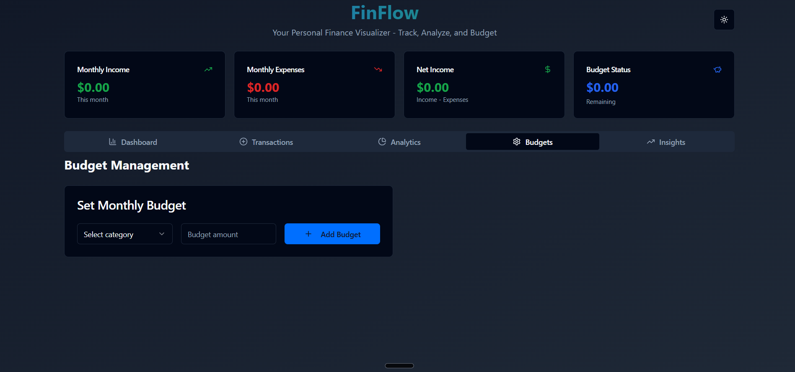
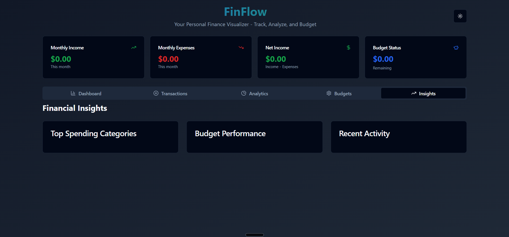
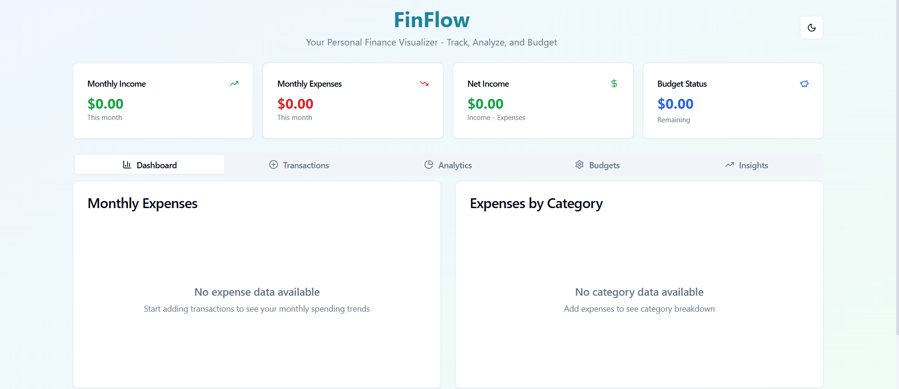

# FinFlow - Personal Finance Visualizer


FinFlow is a comprehensive personal finance management application that helps you track, analyze, and budget your finances with beautiful visualizations and insightful analytics.

## 🌟 Live Demo

**[View Live Application](https://finflow-visual-budgets.vercel.app/)**

## 📸 Screenshots

### Dashboard View

*Main dashboard with financial overview and quick actions*

### Transaction Management

*Add, edit, and manage all your financial transactions*

### Analytics

*Visualize your spending patterns with interactive charts*

### Budget Management

*Set and track monthly budgets for different categories*

### Financial Insights

*Get detailed insights into your financial habits*

### Light Theme

*Clean light theme for better accessibility*

### Add Transaction Form

*Intuitive form to add new income and expense transactions*

## ✨ Features

### Stage 1: Basic Transaction Tracking
- ✅ Add/Edit/Delete transactions (amount, date, description)
- ✅ Transaction list view with sorting and filtering
- ✅ Monthly expenses bar chart
- ✅ Form validation and error handling

### Stage 2: Categories & Analytics
- ✅ Predefined categories for transactions
- ✅ Category-wise pie chart visualization
- ✅ Dashboard with summary cards (total income, expenses, net income)
- ✅ Real-time financial calculations

### Stage 3: Budgeting & Insights
- ✅ Set monthly category budgets
- ✅ Budget vs actual comparison charts
- ✅ Spending insights and performance tracking
- ✅ Budget status indicators (Good/High/Over)

### Additional Features
- 🌙 Dark/Light theme toggle
- 📱 Fully responsive design
- 💾 Local storage data persistence
- 📊 Interactive charts with Recharts
- 🎨 Modern UI with Tailwind CSS and shadcn/ui
- ⚡ Real-time updates and calculations

## 🛠️ Tech Stack

- **Frontend Framework**: React 18 with TypeScript
- **Build Tool**: Vite
- **Styling**: Tailwind CSS
- **UI Components**: shadcn/ui
- **Charts**: Recharts library
- **Icons**: Lucide React
- **State Management**: React Hooks
- **Data Persistence**: localStorage
- **Deployment**: Vercel

## 📁 Project Structure

```
src/
├── components/
│   ├── ui/                     # shadcn/ui components
│   │   ├── button.tsx
│   │   ├── card.tsx
│   │   ├── tabs.tsx
│   │   └── ...
│   ├── BudgetChart.tsx         # Budget visualization component
│   ├── BudgetManager.tsx       # Budget management interface
│   ├── CategoryChart.tsx       # Category pie chart
│   ├── ExpenseChart.tsx        # Monthly expenses bar chart
│   ├── SummaryCards.tsx        # Financial summary cards
│   ├── TransactionForm.tsx     # Add/Edit transaction form
│   └── TransactionList.tsx     # Transaction display component
├── lib/
│   ├── finance-utils.ts        # Financial calculations and utilities
│   └── utils.ts               # General utility functions
├── hooks/
│   └── use-toast.ts           # Toast notification hook
├── pages/
│   ├── Index.tsx              # Main application page
│   └── NotFound.tsx           # 404 error page
└── main.tsx                   # Application entry point
```

## 🚀 Getting Started

### Prerequisites
- Node.js (v16 or higher)
- npm or yarn package manager

### Installation

1. **Clone the repository**
   ```bash
   git clone <repository-url>
   cd finflow
   ```

2. **Install dependencies**
   ```bash
   npm install
   # or
   yarn install
   ```

3. **Start the development server**
   ```bash
   npm run dev
   # or
   yarn dev
   ```

4. **Open your browser**
   Navigate to `http://localhost:5173` to view the application

### Build for Production

```bash
npm run build
# or
yarn build
```

The built files will be in the `dist` directory.

## 💡 Usage

1. **Add Transactions**: Click "Add Transaction" to record income or expenses
2. **Categorize**: Select from predefined categories for better organization
3. **Set Budgets**: Navigate to the Budgets tab to set monthly spending limits
4. **Analyze**: View charts and insights to understand your spending patterns
5. **Track Progress**: Monitor budget performance and financial goals

## 🎨 Customization

### Categories
Edit the `CATEGORIES` array in `src/lib/finance-utils.ts` to add or modify transaction categories.

### Colors
Modify the `CATEGORY_COLORS` object in `src/lib/finance-utils.ts` to change category color schemes.

### Theme
The application supports both light and dark themes with automatic system preference detection.

## 📊 Data Management

- All data is stored locally in your browser's localStorage
- No external database or server required
- Data persists between sessions
- Export/import functionality can be added for data backup

## 🤝 Contributing

1. Fork the repository
2. Create a feature branch (`git checkout -b feature/amazing-feature`)
3. Commit your changes (`git commit -m 'Add amazing feature'`)
4. Push to the branch (`git push origin feature/amazing-feature`)
5. Open a Pull Request

## 📝 License

This project is open source and available under the [MIT License](LICENSE).

## 🔮 Future Enhancements

- [ ] Data export/import functionality
- [ ] Multiple currency support
- [ ] Recurring transaction templates
- [ ] Advanced filtering and search
- [ ] Financial goal tracking
- [ ] Mobile app version
- [ ] Cloud data synchronization

## 📞 Support

If you encounter any issues or have questions, please open an issue on the repository or contact the development team.

---

Made with ❤️ using React, TypeScript, and Tailwind CSS
