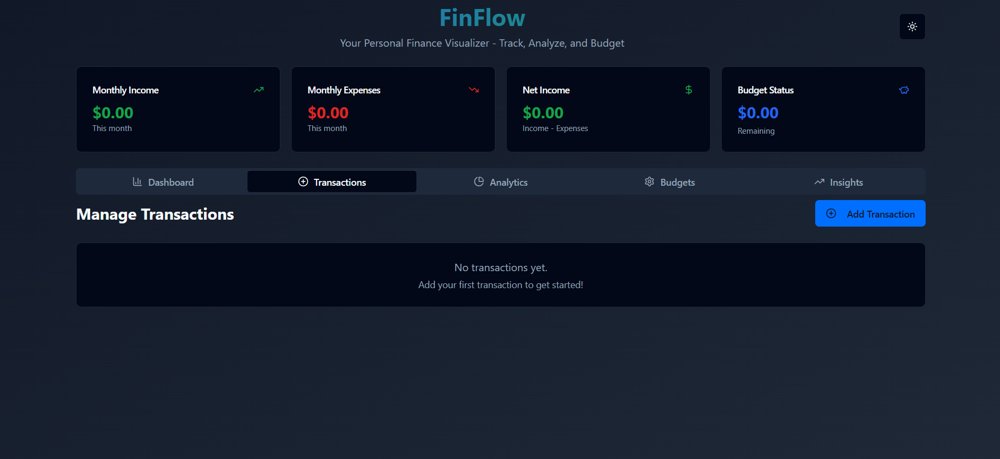

# FinFlow Visual Budgets

Your Personal Finance Visualizer - Track, Analyze, and Budget

---

## Table of Contents
- [Overview](#overview)
- [Features](#features)
- [Tech Stack](#tech-stack)
- [Project Structure](#project-structure)
- [Installation](#installation)
- [Usage](#usage)
- [Screenshots](#screenshots)
- [License](#license)

---

## Overview
FinFlow is a modern personal finance management application that helps you track your income, expenses, budgets, and gain insights into your financial habits. With a clean and intuitive UI, FinFlow empowers users to visualize their finances, set budgets, and make informed decisions.

---

## Features
- **Dashboard**: Visual summary of income, expenses, net income, and budget status.
- **Transactions**: Add, view, and manage income and expense transactions.
- **Analytics**: Visualize monthly expenses and breakdown by category.
- **Budgets**: Set and track monthly budgets for different categories.
- **Insights**: Get financial insights like top spending categories and budget performance.
- **Dark/Light Mode**: Switch between dark and light themes for comfortable viewing.
- **Quick Actions**: Easily add transactions and view active budgets.

---

## Tech Stack
- **Frontend**: React, TypeScript
- **Styling**: Tailwind CSS, custom CSS
- **Build Tool**: Vite
- **State Management**: React hooks
- **Charting**: Likely using a chart library (e.g., Chart.js or similar)
- **Other**: Modern component-based architecture

---

## Project Structure
```
finflow-visual-budgets/
├── public/
├── src/
│   ├── components/
│   │   ├── BudgetChart.tsx
│   │   ├── BudgetManager.tsx
│   │   ├── CategoryChart.tsx
│   │   ├── ExpenseChart.tsx
│   │   ├── SummaryCards.tsx
│   │   ├── TransactionForm.tsx
│   │   ├── TransactionList.tsx
│   │   └── ui/ [...UI components]
│   ├── hooks/
│   ├── lib/
│   ├── pages/
│   ├── App.tsx
│   ├── main.tsx
│   └── index.css
├── index.html
├── package.json
├── tailwind.config.ts
├── vite.config.ts
└── README.md
```

---

## Installation
1. **Clone the repository:**
   ```bash
   git clone <repo-url>
   cd finflow-visual-budgets
   ```
2. **Install dependencies:**
   ```bash
   npm install
   # or
   yarn install
   ```
3. **Start the development server:**
   ```bash
   npm run dev
   # or
   yarn dev
   ```
4. **Open in browser:**
   Visit `http://localhost:5173` (or the port shown in your terminal)

---

## Usage
- Add your income and expense transactions.
- Set monthly budgets for different categories.
- View analytics and insights to understand your spending habits.
- Switch between dark and light mode using the toggle in the top right corner.

---

## Screenshots

### Dashboard (Dark Mode)


### Transactions


### Analytics


### Budgets


### Insights


### Dashboard (Light Mode)


### Add Transaction (Light Mode)


> **Note:** Screenshots are located in the `public/screenshots/` folder.

---

## License
MIT License

---

## Credits
- UI inspired by modern finance dashboards
- Built with React, TypeScript, and Tailwind CSS

---

## Contributing
Pull requests are welcome! For major changes, please open an issue first to discuss what you would like to change.

---

## Contact
For questions or support, please open an issue in the repository. 